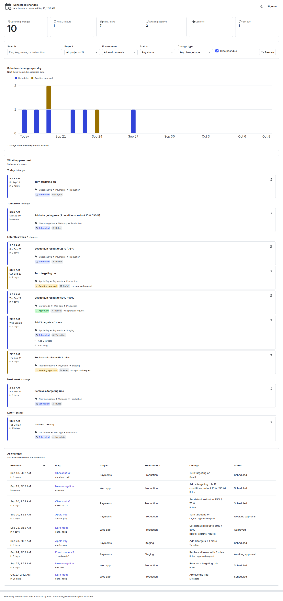
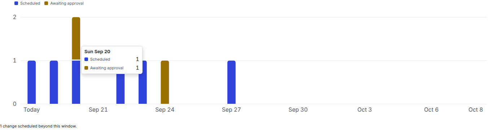
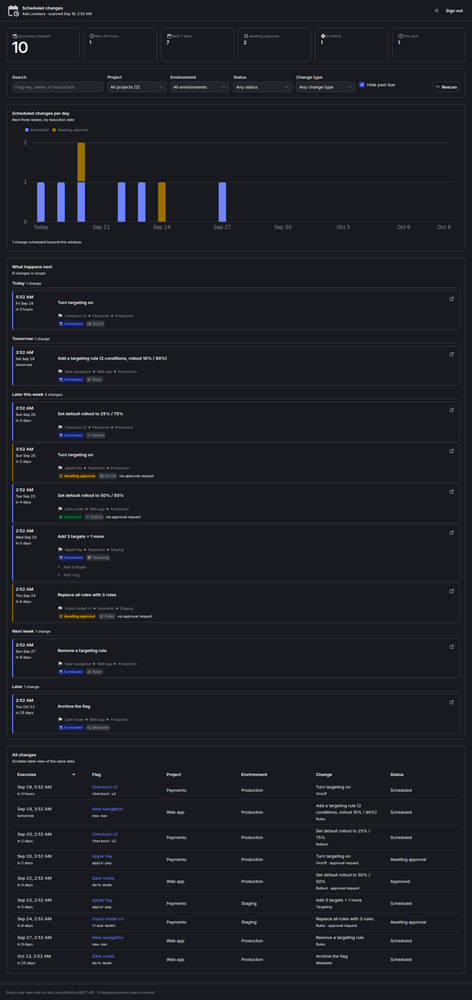
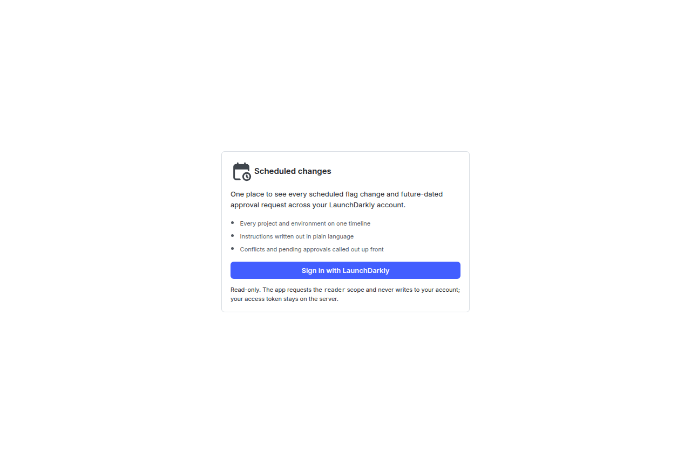

# LaunchDarkly scheduled changes dashboard

A single pane of glass for every **scheduled change** and **future-dated approval request**
in a LaunchDarkly account.

LaunchDarkly will happily let you schedule a flag change six weeks out, in any environment,
in any project. What it will not do is show you all of them together — scheduled changes are
read one flag and one environment at a time, so "what is about to happen to our flags?" has no
answer in the product UI. This app answers it.

It is an OAuth app, it is read-only, and it deploys as a single Cloudflare Worker.



## What you get

- **A day-by-day volume chart** of the next three weeks, split by whether a change will just
  execute or is still waiting on an approval.
- **An agenda** — every upcoming change in execution order, grouped into Today / Tomorrow /
  Later this week / Next week / Later, with the flag, project, environment, status, and the
  change itself written out in plain language (`{"kind":"updateFallthroughVariationOrRollout",
  "rolloutWeights":{…}}` becomes *"Set default rollout to 25% / 75%"*).
- **Headline counts** for the next 24 hours, the next 7 days, changes blocked on approval,
  conflicts LaunchDarkly has flagged, and anything past its execution date.
- **A sortable table** of the same data, so every value in the chart is reachable as text.
- Filters for project, environment, status, change type, and free-text search.
- Light and dark themes, both built from LaunchPad tokens.

Hovering a column reads out that day's split:



Dark mode is its own set of steps from the same LaunchPad ramps, not an inverted light theme:



Signing in is a single button — the app holds no credentials of its own:



## How it works

```
browser  ──►  Cloudflare Worker  ──►  app.launchdarkly.com/api/v2
  │             │
  │             ├─ /auth/login, /auth/callback   OAuth 2.0 authorization code flow
  │             ├─ /api/me                        who is signed in
  │             ├─ /api/ld/*                      read-only, allowlisted API proxy
  │             └─ everything else                the built SPA, from the assets binding
  │
  └─ React 19 + @launchpad-ui/components
```

Three design decisions worth knowing about:

**The access token never reaches the browser.** After the code exchange, the token is sealed
into an AES-GCM blob (`shared/session.ts`) and stored in an `httpOnly`, `Secure`, `SameSite=Lax`
cookie. Only the Worker holds the key, so JavaScript on the page cannot read the token even if
something else on the page goes wrong.

**The proxy is an allowlist, not a pass-through.** `worker/proxy.ts` forwards `GET` and only
`GET`, and only to the fourteen anchored path patterns the dashboard actually reads. A path that
does not match is rejected before a request leaves the Worker. This is what keeps a `reader`
token from being usable for anything beyond this dashboard's job.

**The fan-out happens in the browser, through the proxy.** Scheduled changes live at
`/projects/{p}/flags/{f}/environments/{e}/scheduled-changes`, so finding them all means one
request per flag × environment pair. Doing that inside a single Worker invocation would hit the
subrequest limit immediately. Instead the browser issues the requests at bounded concurrency
(`src/lib/scan.ts`), and each one costs the Worker a single subrequest. Account-wide approval
requests come from one paginated endpoint and are merged in.

Cost is flags × environments, so **narrowing the environment filter and rescanning is the big
lever** — scanning production only is roughly four times cheaper than scanning four
environments. The client honours LaunchDarkly's `X-Ratelimit-Reset` and retries with backoff,
and the scan reports progress while it runs.

## Setup

### 1. Register an OAuth client

LaunchDarkly has no UI for this; use the API with an access token that can write `acct`
resources (an Admin's token).

```sh
curl -X POST https://app.launchdarkly.com/api/v2/oauth/clients \
  -H "Authorization: $LD_API_TOKEN" \
  -H 'Content-Type: application/json' \
  -d '{
    "name": "Scheduled changes dashboard",
    "description": "Read-only dashboard of upcoming scheduled flag changes",
    "redirectUri": "https://YOUR-WORKER-HOST/auth/callback"
  }'
```

The response contains `_clientId` and `_clientSecret`. **`_clientSecret` is shown exactly
once** — if you lose it you have to register a new client.

Constraints LaunchDarkly places on the redirect URI, which shape the config below:

- one redirect URI per client, matched exactly
- no query parameters in the URI
- so the URI is always `<origin>/auth/callback`

For local development, register a second client with
`redirectUri: "http://localhost:8787/auth/callback"`.

By default a new client is **unverified**, which means only members of your own LaunchDarkly
organization can authorize it. That is exactly what you want for an internal dashboard.

### 2. Configure the Worker

```sh
npm install

# Secrets (never in wrangler.jsonc)
npx wrangler secret put LD_CLIENT_ID
npx wrangler secret put LD_CLIENT_SECRET
npx wrangler secret put SESSION_SECRET   # openssl rand -hex 32
```

For `wrangler dev`, copy `.dev.vars.example` to `.dev.vars` and fill it in. `.dev.vars` is
gitignored.

| Variable | Required | What it does |
|---|---|---|
| `LD_CLIENT_ID` | yes | OAuth client id |
| `LD_CLIENT_SECRET` | yes | OAuth client secret |
| `SESSION_SECRET` | yes | Seals the session cookie. Rotating it signs everyone out. |
| `LD_INSTANCE` | no | `us` (default) or `federal` for `app.launchdarkly.us` |
| `PUBLIC_ORIGIN` | no | Set only if something in front of the Worker rewrites the Host header; the redirect URI has to match what you registered |

### 3. Run it

```sh
npm run build     # vite build -> dist/
npm run dev       # wrangler dev: Worker + assets on http://localhost:8787
npm run deploy    # build, then wrangler deploy
```

`npm run dev:vite` runs Vite alone on port 5173, which is useful for UI work but has no
`/auth` or `/api` routes behind it.

## Permissions

The app requests the **`reader`** scope. An OAuth app can never exceed the permissions of the
member who authorized it, so a member who cannot read an environment will not see its scheduled
changes here either. Those denials are expected on a large account: the scan collects them and
reports the count rather than failing, and the results shown are complete for everything that
could be read.

Nothing in this app writes to LaunchDarkly. There is no code path that issues a non-`GET`
request to the API.

## Development

```sh
npm run typecheck     # app and worker, separately (different global types)
npm test              # vitest
npm run lint          # biome
npm run format        # biome --write
npm run screenshots   # regenerate docs/screenshots from the built app
```

`npm run screenshots` needs a build first (`npm run build`). It serves `dist/`, answers the
app's API calls from `scripts/fixtures.mjs`, and captures the images in this README — so it
also works as a smoke test of the built bundle, failing on any console or page error. The
fixtures are a made-up account; no real data goes into the docs.

| Path | What lives there |
|---|---|
| `worker/` | OAuth flow, session loading, the read-only proxy, asset serving |
| `shared/` | Code used by both sides: session sealing, constants. Platform-neutral. |
| `src/api/` | Typed client for the proxy, with pagination and rate-limit retries |
| `src/lib/` | The domain logic: instruction humanizer, change model, scan, filters, time |
| `src/components/` | LaunchPad-based UI |
| `test/` | Unit tests for the pure logic and the proxy allowlist |
| `scripts/` | Screenshot generation and its fixture account |
| `docs/screenshots/` | The images in this README |

### Chart colours

`src/lib/palette.ts` documents the two series colours and why those specific steps: they are
LaunchPad ramp steps chosen so the pair passes a full palette check — lightness band, chroma
floor, colour-vision-deficiency separation, normal-vision separation, and contrast against the
surface — in light *and* dark mode. Dark mode is a deliberate re-step from the same ramps, not
an automatic inversion. Series identity is always carried by a legend and a text label as well
as the colour; status (conflict, approval state) uses LaunchPad's reserved status colours with
an icon and a word.

### Adding an instruction kind

When LaunchDarkly adds a semantic-patch instruction, `describeInstruction` in
`src/lib/instructions.ts` falls back to a de-camel-cased kind (`someNewInstruction` →
*"Some new instruction"*), so nothing renders blank. Add a `case` for a better sentence and an
entry in `CATEGORY_BY_KIND` so it groups and filters correctly.

## Known limits

- **There is no "all scheduled changes" endpoint.** The scan is the workaround, and on a large
  account a full unfiltered pass is thousands of requests. Filter, then rescan.
- **Results are a snapshot**, taken when the scan ran. The header shows the scan time; use
  Rescan to refresh.
- **Approval requests are fetched account-wide** and filtered client-side to the chosen scope,
  which keeps that part of the scan to a single paginated endpoint.
